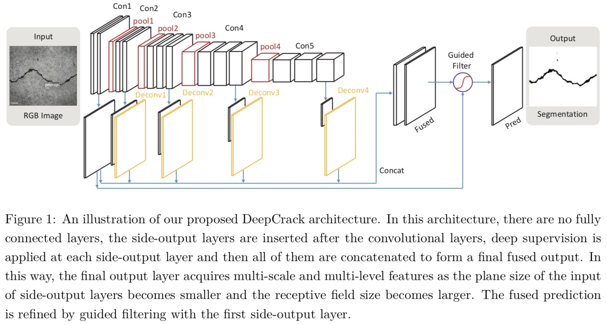
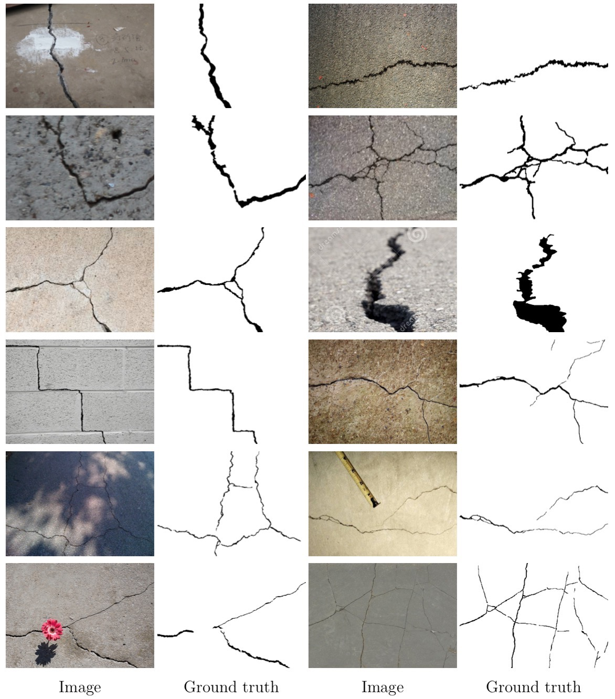

## DeepCrack: A Deep Hierarchical Feature Learning Architecture for Crack Segmentation

 - **Paper**: [[available in Neurocomputing]](https://www.sciencedirect.com/science/article/pii/S0925231219300566), Dec 14, 2017 submitted, Jan 21, 2019 accepted.
 - **Architecture**: based on [HED](https://arxiv.org/abs/1504.06375).



 - **Dataset**:

We established a public benchmark dataset with cracks in multiple scales and scenes to evaluate the crack detection systems. All of the crack images in our dataset are manually annotated.

You can find the dataset in `./dataset`, and here are the details:

|Folder|Description|
|:----|:-----|
|`train_img`|RGB images for training|
|`train_lab`|binary annotation for training images|
|`test_img`|RGB images for testing|
|`test_lab`|binary annotation for testing images|

A brief overview on our crack detection dataset:



 - **Citation:**

If you use this dataset for your research, please cite our paper:


```
@article{liu2019deepcrack,
title={DeepCrack: A Deep Hierarchical Feature Learning Architecture for Crack Segmentation},
author={Yahui, Liu and Jian, Yao and Xiaohu, Lu and Renping, Xie and Li, Li},
journal={Neurocomputing},
year={2018},
}
```

You are also welcomed to Email me: yahui.cvrs@gmail.com .